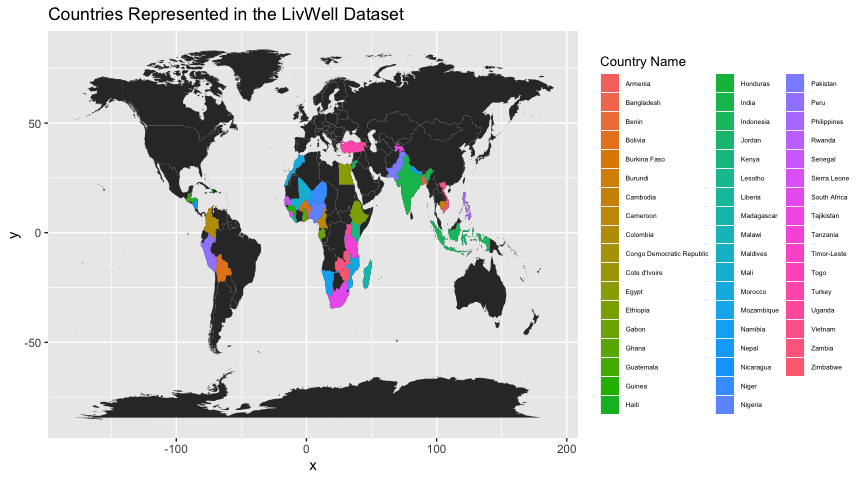
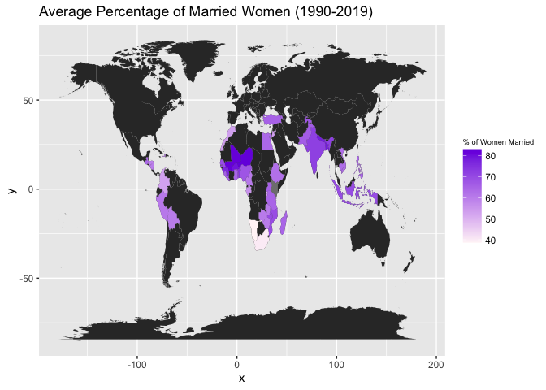
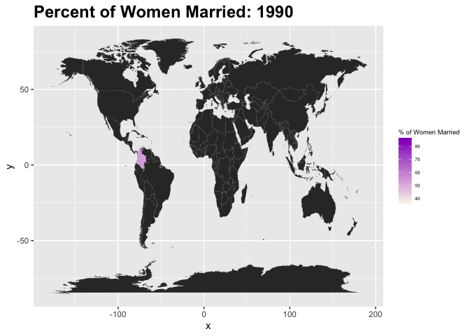
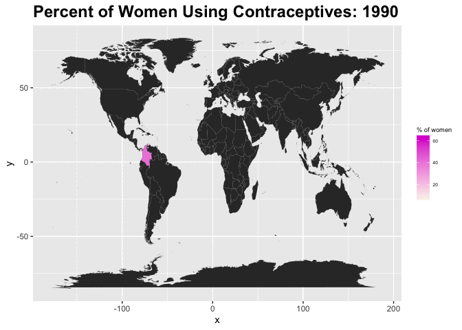
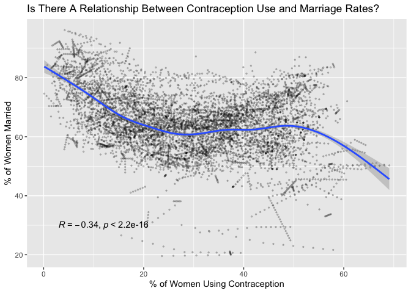

# Background and Motivating Questions

> Since the 1990s, global marriage rates have been on a steady decline
> (Esteban Ortiz-Ospina and Max Roser 2020). In the United States, rates
> are the lowest point in recorded history, and the same is true for the
> United Kingdom and Australia. Changing attitudes towards non-nuclear
> family structures, the widespread use of contraception, and the
> increased number of working women are all possible factors that have
> contributed to the decline in marriage (Esteban Ortiz-Ospina and Max
> Roser 2020, George A. Akerlof and Janet L. Yellen 1996).

> While much research has been done on this phenomenon in wealthy
> countries, less attention has been paid to marriage trends in low to
> mid-income nations. The following blog post explores trends in
> marriage rates amongst 52 developing countries from 1990-2019.

> Our motivating questions are: 1. Which countries in our dataset have
> the highest rates of marriage? 2. How have marriage rates changed
> between 1990-2019 for countries in our dataset? 3. Is there a
> relationship between the use of contraceptives and changes in marriage
> rates among the countries in our dataset?

# The Data

    #load packages
    library(tidyverse)
    library(maps)
    library(gganimate)
    library(transformr)
    library(knitr)
    library(ggpubr)

    # load the data
    # datasets can be downloaded at the link below
    # change these two lines to your specific file path name
    live_well <- read_csv("livwell_lin_interpolated.csv")
    indicators <- read_csv("indicators.csv")

> We employ the *LivWell* dataset published in Nature Magazine by
> Camille Belmin et al. (2022), a longitudinal dataset on the health and
> well-being of women in low to middle income countries. The data were
> collected primarily through the Demographic and Health Survey (DHS)
> and features observations from 1990-2019. Data can be downloaded
> \[here\]{<https://zenodo.org/record/7277104>}.

> Below is a map of all of the countries included in our dataset.

    #plotted with ggplot2
    world_map <- map_data("world")

    ggplot(live_well) +
      geom_map(
        data = world_map, map = world_map, aes(map_id = region))+
      geom_map(map = world_map, aes(map_id = country_name, fill = country_name), size = 0.25) +
      expand_limits(x = world_map$long, y = world_map$lat) +
      theme(legend.title = element_text(size=10),
            legend.text = element_text(size = 5),
            legend.key.size = unit(0.50, 'cm'))+
      labs(title = "Countries Represented in the LivWell Dataset",
           fill = "Country Name")

# Exploration

### Average Percentage of Women Married Across All Years

    # wrangle the data
    married_women <- live_well %>% group_by(country_code, country_name) %>%
                                          summarize(mean_married = mean(DM_marr_p))

    world_map <- map_data("world")

    ggplot(married_women) +
      geom_map(
        data = world_map, map = world_map, aes(map_id = region))+
      geom_map(map = world_map, aes(map_id = country_name, fill = mean_married), size = 0.25) +
      scale_fill_gradient(low = "#fff5f7", high = "#7722e0", name = "% of Women Married") +
      expand_limits(x = world_map$long, y = world_map$lat) +
      theme(legend.title = element_text(size=7))+
      labs(title = "Average Percentage of Married Women (1990-2019)")

### Countries with the Highest Mean Percentage of Women Married Across All Years

    married_women_high <- live_well %>% group_by(country_code, country_name) %>%
                                       summarize(mean_married = mean(DM_marr_p)) %>%
                                       drop_na()%>%
                                       ungroup() %>%
                                       top_n(n=10, mean_married) %>% 
                                       arrange(desc(mean_married))

    kable(married_women_high)

<table>
<thead>
<tr class="header">
<th style="text-align: left;">country_code</th>
<th style="text-align: left;">country_name</th>
<th style="text-align: right;">mean_married</th>
</tr>
</thead>
<tbody>
<tr class="odd">
<td style="text-align: left;">NER</td>
<td style="text-align: left;">Niger</td>
<td style="text-align: right;">83.12583</td>
</tr>
<tr class="even">
<td style="text-align: left;">MLI</td>
<td style="text-align: left;">Mali</td>
<td style="text-align: right;">82.49166</td>
</tr>
<tr class="odd">
<td style="text-align: left;">BFA</td>
<td style="text-align: left;">Burkina Faso</td>
<td style="text-align: right;">79.76038</td>
</tr>
<tr class="even">
<td style="text-align: left;">BGD</td>
<td style="text-align: left;">Bangladesh</td>
<td style="text-align: right;">78.88787</td>
</tr>
<tr class="odd">
<td style="text-align: left;">NPL</td>
<td style="text-align: left;">Nepal</td>
<td style="text-align: right;">78.47509</td>
</tr>
<tr class="even">
<td style="text-align: left;">GIN</td>
<td style="text-align: left;">Guinea</td>
<td style="text-align: right;">76.48902</td>
</tr>
<tr class="odd">
<td style="text-align: left;">BEN</td>
<td style="text-align: left;">Benin</td>
<td style="text-align: right;">74.08212</td>
</tr>
<tr class="even">
<td style="text-align: left;">IND</td>
<td style="text-align: left;">India</td>
<td style="text-align: right;">71.89845</td>
</tr>
<tr class="odd">
<td style="text-align: left;">MWI</td>
<td style="text-align: left;">Malawi</td>
<td style="text-align: right;">70.42167</td>
</tr>
<tr class="even">
<td style="text-align: left;">IDN</td>
<td style="text-align: left;">Indonesia</td>
<td style="text-align: right;">69.52538</td>
</tr>
</tbody>
</table>

### Countries with the Lowest Mean Percentage of Women Married Across All Years

    married_women_low <- live_well %>% group_by(country_code, country_name) %>%
                                       summarize(mean_married = mean(DM_marr_p)) %>%
                                       drop_na()%>%
                                       ungroup() %>%
                                       top_n(n=-10, mean_married)%>%
                                       arrange(mean_married)

    kable(married_women_low)

<table>
<thead>
<tr class="header">
<th style="text-align: left;">country_code</th>
<th style="text-align: left;">country_name</th>
<th style="text-align: right;">mean_married</th>
</tr>
</thead>
<tbody>
<tr class="odd">
<td style="text-align: left;">NAM</td>
<td style="text-align: left;">Namibia</td>
<td style="text-align: right;">38.64104</td>
</tr>
<tr class="even">
<td style="text-align: left;">ZAF</td>
<td style="text-align: left;">South Africa</td>
<td style="text-align: right;">39.98875</td>
</tr>
<tr class="odd">
<td style="text-align: left;">RWA</td>
<td style="text-align: left;">Rwanda</td>
<td style="text-align: right;">50.90637</td>
</tr>
<tr class="even">
<td style="text-align: left;">COL</td>
<td style="text-align: left;">Colombia</td>
<td style="text-align: right;">52.94695</td>
</tr>
<tr class="odd">
<td style="text-align: left;">MAR</td>
<td style="text-align: left;">Morocco</td>
<td style="text-align: right;">53.36000</td>
</tr>
<tr class="even">
<td style="text-align: left;">JOR</td>
<td style="text-align: left;">Jordan</td>
<td style="text-align: right;">53.80889</td>
</tr>
<tr class="odd">
<td style="text-align: left;">LSO</td>
<td style="text-align: left;">Lesotho</td>
<td style="text-align: right;">54.28518</td>
</tr>
<tr class="even">
<td style="text-align: left;">BDI</td>
<td style="text-align: left;">Burundi</td>
<td style="text-align: right;">54.40375</td>
</tr>
<tr class="odd">
<td style="text-align: left;">GAB</td>
<td style="text-align: left;">Gabon</td>
<td style="text-align: right;">55.75700</td>
</tr>
<tr class="even">
<td style="text-align: left;">HTI</td>
<td style="text-align: left;">Haiti</td>
<td style="text-align: right;">57.92634</td>
</tr>
</tbody>
</table>

> After averaging the percentage of women married across all years and
> subregions (i.e. different counties in each country), we found that
> three adjacent countries in West Africa, Mali, Niger, and Burkina
> Faso, had the highest percentages of married women averaged across
> 1990-2019. Meanwhile, Namibia, South Africa, and Rwanda had the lowest
> percentages of married women, with only 38.64% of women in Namibia
> married on average.

### Marriage Rates Over Time

    married_women <- live_well %>% group_by(year, country_name, country_code) %>%
                                   summarize(mean_married = mean(DM_marr_p)) %>%
                                   rename("year_" = year)

    gif <- ggplot(married_women) +
        geom_map(data = world_map, map = world_map, aes(map_id = region))+
      geom_map(map = world_map, aes(map_id = country_name, fill = mean_married, group = year_), size = 0.25) +
      scale_fill_gradient(low = "#faf6eb", high = "#8f02c2", name = "% of Women Married") +
      expand_limits(x = world_map$long, y = world_map$lat) +
      theme(legend.title = element_text(size=5))+
        theme(
              legend.title=element_text(size=7),
              legend.text=element_text(size = 5),
              legend.position="right",
              plot.title = element_text(lineheight=.8, face="bold", size=18),
              legend.key.size = unit(0.50, 'cm'),
              legend.key.height = unit(0.50, 'cm'), 
              legend.key.width = unit(0.50, 'cm'))+
        transition_time(year_)+
      transition_states(
        year_,
        transition_length = 1,
        state_length = 4) +
       ease_aes('sine-in-out') +
    labs(title = "Percent of Women Married: {closest_state}")

    gif

    anim_save("married.gif", gif)

> In this animation, countries with observations for a given year appear
> on the map. Not all countries have observations for every year. From
> the map, we observe that the percentage of married women was generally
> consistent in each country. Percentages did not drastically fluctuate,
> and countries tended to have a steady increase or decrease in marriage
> rates.

## Contraception Rates Over Time

    contraceptives <- live_well %>% group_by(year, country_name, country_code) %>%
                                   summarize(mean_contra = mean(RH_contr_p)) %>%
                                   rename("year_" = year)

    contra_gif <- ggplot(contraceptives) +
        geom_map(data = world_map, map = world_map, aes(map_id = region))+
      geom_map(map = world_map, aes(map_id = country_name, fill = mean_contra, group = year_), size = 0.25) +
      scale_fill_gradient(low = "#faf6eb", high = "#db07d1", name = "% of women") +
      expand_limits(x = world_map$long, y = world_map$lat) +
        theme(legend.title=element_text(size=7),
              legend.text=element_text(size = 5),
              legend.position="right",
              plot.title = element_text(lineheight=.8, face="bold", size=18),
              legend.key.size = unit(0.50, 'cm'),
              legend.key.height = unit(0.50, 'cm'), 
              legend.key.width = unit(0.50, 'cm'))+
        transition_time(year_)+
      transition_states(
        year_,
        transition_length = 1,
        state_length = 4) +
       ease_aes('sine-in-out') +
    labs(title = "Percent of Women Using Contraceptives: {closest_state}")

    contra_gif

    anim_save("contraceptives.gif", contra_gif)

> Already, we see an inverse relationship between the percentage of
> women married and the percentage of women using contraception. It
> seems that the higher the rate of women using contraception, the lower
> the marriage rate. For instance, there is a noticeable increase of
> contraception use in South Africa and a noticeable decrease in
> marriage. Let’s examine this relationship further.

    ggplot(live_well, aes(x = RH_contr_p, y = DM_marr_p))+
    geom_point(size = 0.5, alpha = 0.2)+ 
    geom_smooth()+
    stat_cor(method = "pearson", label.x = 3, label.y = 30)+
    labs(x = "% of Women Using Contraception", y = "% of Women Married",
         title = "Is There A Relationship Between Contraception Use and Marriage Rates?")

> After finding the Pearson Correlation between the percentage of women
> married versus the percentage of women using contraception for all
> subregions and all years available in the dataset, we found a weak,
> negative relationship between the two variables. However, when we plot
> the data, we see that there is a slight, upward-facing parabolic curve
> and that the line of best fit that trends downwards is primarily
> influenced by outliers. This relationship implies that countries with
> low and high rates of women using contraception have relatively high
> rates of marriage while countries with ~20-40% of women using
> contraception have the lowest rates of married women. Other variables,
> such as religious conservatism or wealth, could be confounding our
> results and be a stronger indication of marriage rates.

# Future Directions

> This blog post serves as an exploratory analysis to our inquiry into
> marriage trends among women in low to middle income nations. Though we
> predicted that contraception use rates would be a predictor of
> marriage rates, we only found a weak, negative relationship between
> the two variables in our data. A multivariate analysis such as
> multiple regression could be pursued to determine other predictors of
> marriage rates and to find the relationship between various factors.

# Brief Bibliography

Camille Belman, Roman Hoffman, Mahmoud Elkasabi & Peter-Paul Pichler.
LivWell: a sub-national Dataset on the Living Conditions of Women and
their Well-being for 52 Countries. Sci Data 9, 719 (2022).
<https://doi.org/10.1038/s41597-022-01824-2>

Esteban Ortiz-Ospina and Max Roser (2020) - “Marriages and Divorces”.
Published online at OurWorldInData.org. Retrieved from:
‘<https://ourworldindata.org/marriages-and-divorces>’.

George A. Akerlof and Janet L. Yellen (1996) - “New Mothers, not
married: Technology shock, the demise of shotgun marriage, and the
increase in out-of-wedlock births”. Brookings Institute.
<https://www.brookings.edu/articles/new-mothers-not-married-technology-shock-the-demise-of-shotgun-marriage-and-the-increase-in-out-of-wedlock-births/>.
